# PocketLedger — Personal Finance Tracker

[](https://github.com/krit-vardhan-mishra/pocket-ledger/actions/workflows/android.yml)

**PocketLedger** is a high-performance, offline-first personal finance application built natively for Android. It combines modern architecture with a privacy-centric design to help users track their spending without compromising their data.

## ✨ App Launchpad

<table>
	<tr>
		<td width="50%" valign="top">
			<h3>Track your money effortlessly.</h3>
			<p>
				The offline-first personal finance tracker.<br>
				<strong>No login. No tracking. No cloud.</strong>
			</p>
			<p>
				
				
				
			</p>
		</td>
		<td width="50%" align="center">
			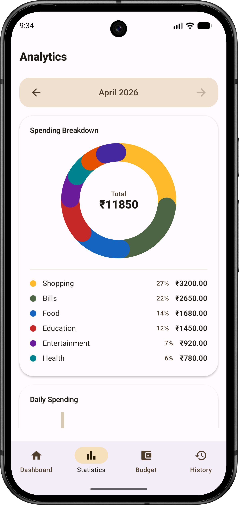
			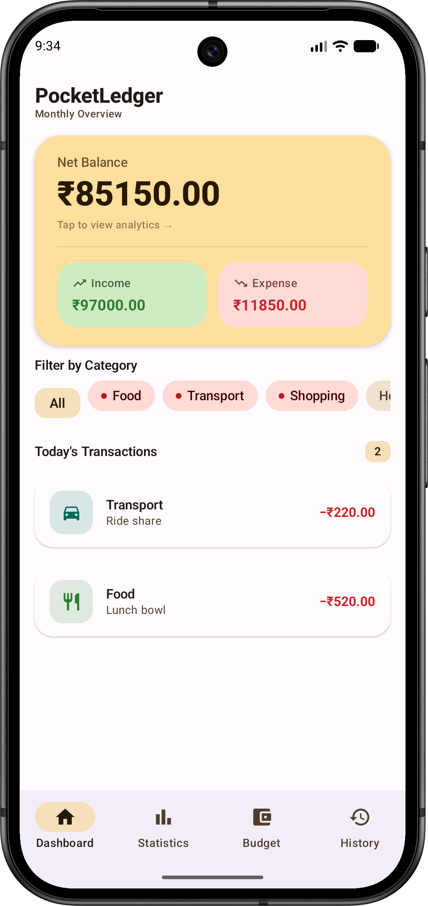
		</td>
	</tr>
</table>

<!-- Launch pads: four images, stacked one per row -->
<div align="center" style="margin: 24px 0;">
	<div style="margin: 12px 0;">
		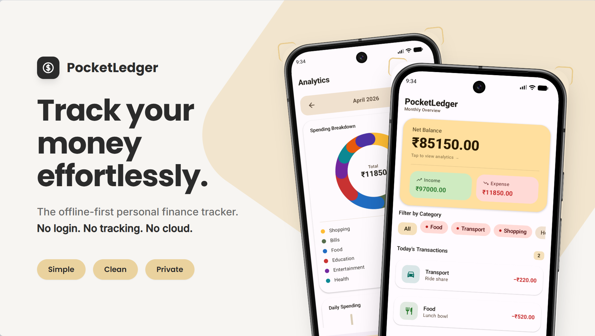
	</div>
	<div style="margin: 12px 0;">
		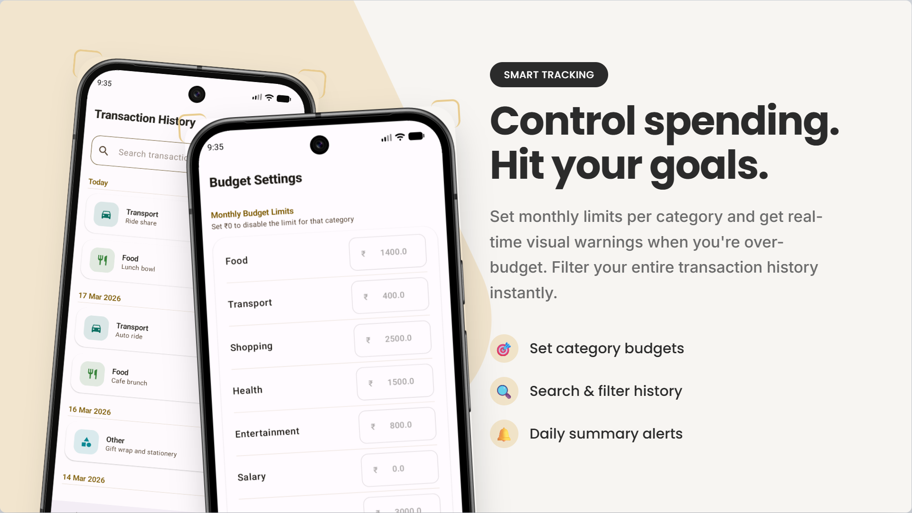
	</div>
	<div style="margin: 12px 0;">
		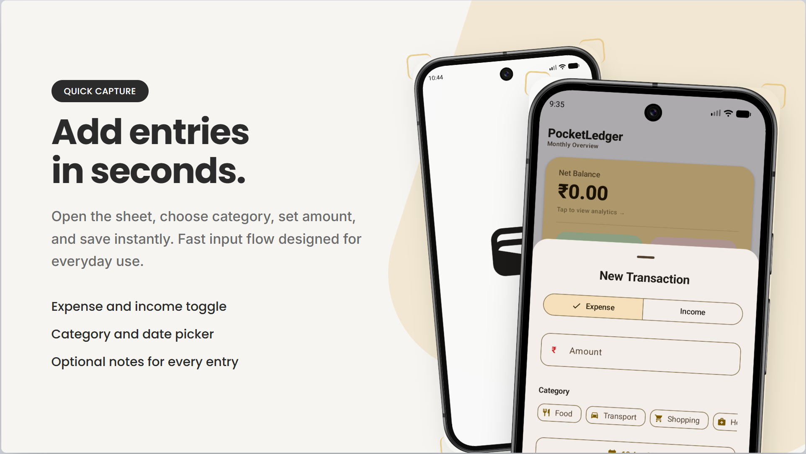
	</div>
	<div style="margin: 12px 0;">
		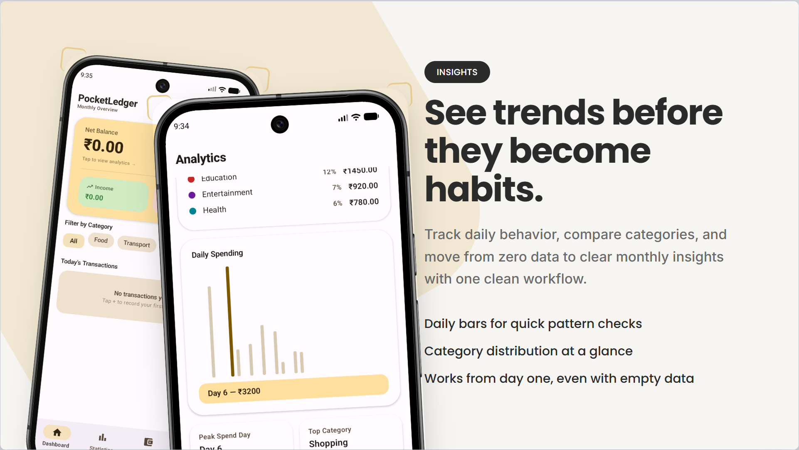
	</div>
</div>

<h3>📱 App Screenshots</h3>

<table>
	<tr>
		<td align="center" width="25%">
			<br>
			<sub><b>Dashboard</b></sub>
		</td>
		<td align="center" width="25%">
			<br>
			<sub><b>Analytics</b></sub>
		</td>
		<td align="center" width="25%">
			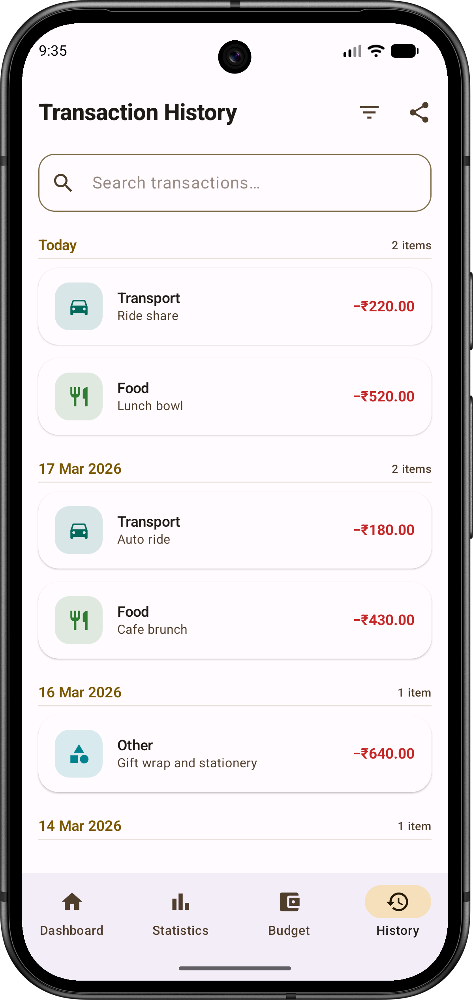<br>
			<sub><b>Transaction History</b></sub>
		</td>
		<td align="center" width="25%">
			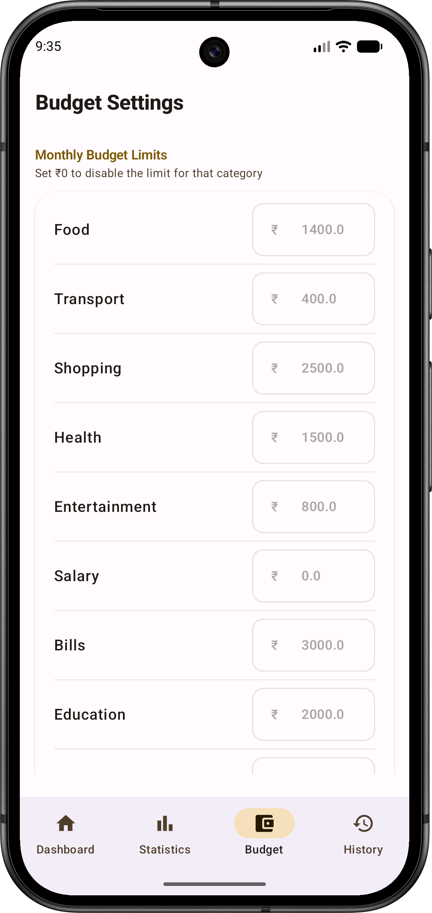<br>
			<sub><b>Budget Settings</b></sub>
		</td>
	</tr>
	<tr>
		<td align="center" width="25%">
			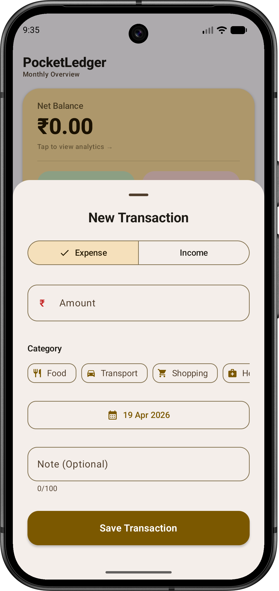<br>
			<sub><b>Add Transaction</b></sub>
		</td>
		<td align="center" width="25%">
			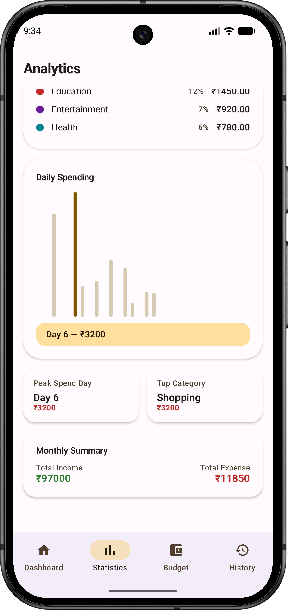<br>
			<sub><b>Daily Spending</b></sub>
		</td>
		<td align="center" width="25%">
			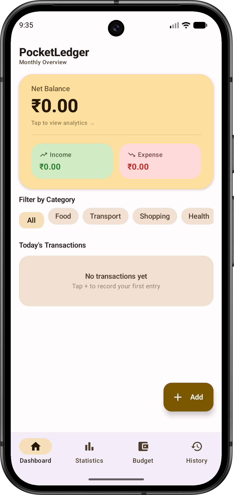<br>
			<sub><b>Empty State</b></sub>
		</td>
		<td align="center" width="25%">
			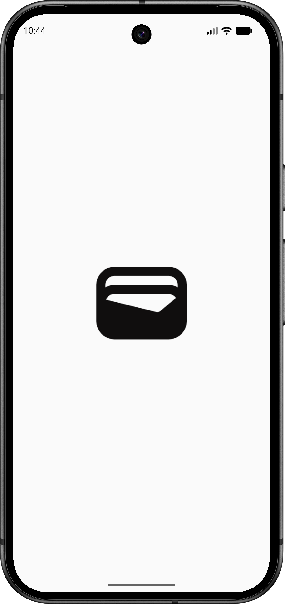<br>
			<sub><b>Splash Screen</b></sub>
		</td>
	</tr>
</table>

## 🚀 Key Features

- **Privacy-First Storage:** All data stays on your device in a secure Room database. No cloud, no tracking.
- **Modern Jetpack Compose UI:** A fluid, interactive interface inspired by Material 3 design principles.
- **Intelligent Budgeting:** Set monthly limits per category and get real-time visual warnings (Red chips) when you're over-budget.
- **Proactive Notifications:** Receive daily summaries at your preferred time using Android's WorkManager API.
- **Rich Analytics:** Interactive donut and daily bar charts (Compose Canvas) with tap selection and contextual summaries.
- **CSV Export:** Share your transaction records for external auditing or backups.

## 🛠️ Technical Deep Dive

### **Architecture & State Management**
PocketLedger follows the **MVVM (Model-View-ViewModel)** architecture pattern.
- **UI Layer:** Built with **Jetpack Compose**, observing state from ViewModels.
- **Domain Layer:** Uses **UseCases** to encapsulate business logic (e.g., calculating monthly summaries).
- **Data Layer:** A single source of truth using **Room Database**.

### **Tech Stack**
- **Language:** Kotlin (100%)
- **UI:** Jetpack Compose (Declarative UI)
- **Dependency Injection:** Hilt (Dagger)
- **Asynchronous:** Kotlin Coroutines & Flow
- **Local Storage:** Room Persistence Library
- **App Settings:** DataStore Preferences
- **Background Tasks:** WorkManager
- **Charts:** Custom Compose Canvas charts
- **CI/CD:** GitHub Actions (automated testing on every push)

## 🧪 Testing
Quality is baked into the code:
- **Unit Testing:** ViewModel and repository behavior tested with JUnit4, MockK, and coroutines-test.
- **Coverage Reports:** JaCoCo HTML/XML reports via `:app:jacocoTestReport`.
- **Continuous Integration:** Every commit runs tests, assembles debug APK, and uploads test + coverage reports.

## 📁 Repository Structure
```text
app/src/main/java/com/just_for_fun/pocketledger/
├── data/       # Persistence (Room), Models, and Repositories
├── domain/     # Logic specific to business rules (UseCases)
├── ui/         # All UI components, screens, and ViewModels
├── worker/     # Android WorkManager background tasks
└── di/         # Dependency Injection modules for Hilt
```

## ✅ Useful Commands
```bash
./gradlew test
./gradlew :app:assembleDebug
./gradlew :app:jacocoTestReport
```

## 📦 Getting Started
1. Clone the repository.
2. Open in **Android Studio Hedgehog** or later.
3. Sync Gradle and run on a physical device or emulator (API 26+ recommended).

---
**Author:** Kirti Vardhan Mishra  
**License:** MIT
